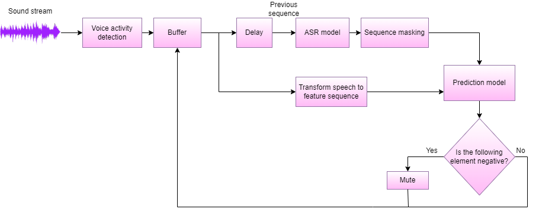

Solution **profanity-predictor** is designed for the task of real-time profanity prediction based on the multimodal (audio and textual channels of the speech) analysis.

.. image:: https://img.shields.io/badge/License-BSD_3--Clause-blue.svg
   :target: https://opensource.org/license/bsd-3-clause/

Description
===============

The proposed pipeline allows for working with a sound stream in a standby fashion.
It transforms the signal to MFCC to deal with the audio channel's information and process ASR to extend the set of features with previous word labels.
The prediction model is the LSTM with attention layers.

Installation
===============

Clone repository:

.. code-block:: bash

    git clone https://github.com/expertspec/profanity-predictor.git

Install all dependencies from ``requirements.txt`` file:

.. code-block:: bash

    pip install -r requirements.txt

How to Use
==========

.. code-block:: bash

    /profanity-predictor
        ├── assets  # Images for readme
        ├── data 
        │   ├── banned_words.txt
        │   └── test_records
        ├───src         # Executive files
        │   ├───features        # Scripts for features extraction
        │   │   └───tools
        │   ├───models          # Models's architecture and tools for usage
        │   └───preprocessing   # Scripts for dataset preporation
        └───weights     # Folder for model's weights

It is possible to download `test records <https://drive.google.com/drive/folders/1RRHt0MA1Z-qWDs3sOnyTml5azjzgsq4o?usp=sharing>`_ for quick start.

Default weights for prediction model can be download `here <https://drive.google.com/file/d/1JJe3na8wSBkHbrxSlFPtIgT_-QAIy7BH/view?usp=sharing>`_

Run inference for prediction on the samples from test records

.. code-block:: bash

    $  python3 data_inference.py ./data/test_records --device cpu  

It is also possible to specify arguments "--path_to_banned_words" and "--weights"

Run inference for working with speech stream

.. code-block:: bash

    $  python3 stream_inference.py

Dataset
=============
The dataset is available `here <https://huggingface.co/datasets/Lameus/en_spontaneous_profanity>`_

Article
=============
`Multimodal prediction of profanity based on speech analysis <https://www.sciencedirect.com/science/article/pii/S1877050923019981>`_

Backlog
=============

- [x] Initial inference for test data
- [x] Real-time implementation
- [ ] Examples
- [ ] Tests

Supported by
============

.. image:: assets/itmo_logo.png
    :width: 300px
    :align: center
    :alt: ITMO university logo

Funding research project No. 622279 "Development of a service for assessing the validity of expert opinion based on dynamic intelligent analysis of video content".

Citation
========

.. code-block:: bash

    @software{expertspec,
        title = {profanity-predictor},
        author = {Smirnov, Ivan},
        year = {2023},
        url = {https://github.com/expertspec/profanity-predictor},
        version = {0.0.1}
    }
