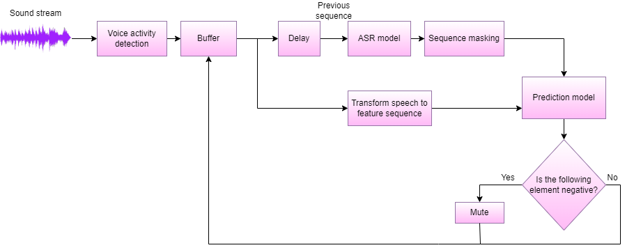

Solution **profanity-predictor** is designed for the task of real-time profanity prediction based on the multimodal (audio and textual channels of the speech) analysis.

Description
===============

The proposed pipeline allows for working with a sound stream in a standby fashion.
It transforms the signal to MFCC to deal with the audio channel's information and process ASR to extend the set of features with previous word labels.
The prediction model is the LSTM with attention layers.

Installation
===============

Clone repository:

.. code-block:: bash

    $ git clone https://github.com/expertspec/profanity-predictor.git

Install all dependencies from ``requirements.txt`` file:

.. code-block:: bash

    $ pip install -r requirements.txt

How to Use
==========

src/data - scripts for dataset preporation
src/features - scripts for features extraction
src/models - models's architecture and tools for usage
src/notebooks - examples

It is possible to download [test records](https://drive.google.com/drive/folders/1RRHt0MA1Z-qWDs3sOnyTml5azjzgsq4o?usp=sharing) for quick start.
Default weights for prediction model can be download [here](https://drive.google.com/file/d/1wG8P5OfGgSoRnPqthSjSDosvUsqJaXF2/view?usp=sharing)

.. code-block:: bash
python3 inference.py profanity-predictor/src/data/test_records cuda profanity-predictor/weights/model_attention_asr.pth

Backlog
=============

- [x] Initial inference for test data
- [ ] Real-time implementation
- [ ] Examples
- [ ] Tests

Supported by
============

Funding research project No. 622279 "Development of a service for assessing the validity of expert opinion based on dynamic intelligent analysis of video content".

